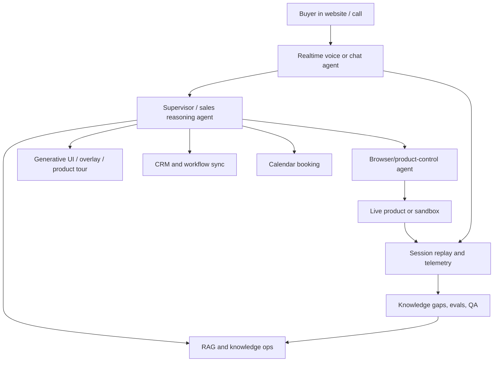

# Open-Source Reference Implementations For Agentic Demo / Website-Agent Products

Generated: 2026-06-20

## Bottom Line

I did not find a complete open-source clone of Karumi, Interact AI, or Hobbes. The closest public references are composable building blocks:

- Browser agents that can operate a real web product.
- Realtime voice/video agent frameworks.
- Sales-agent conversation state machines.
- Agent workflow/RAG platforms.
- Generative UI and in-app copilot frameworks.
- Product-tour, session-replay, CRM, scheduling, and analytics infrastructure.

The best reference stack for a serious prototype would be:

1. `browser-use` or `Stagehand` for product/browser control.
2. `LiveKit Agents`, `Pipecat`, or OpenAI's realtime agents demo for live voice/video.
3. `SalesGPT` for sales-stage logic, objection handling, and tool use.
4. `Dify`, `LangGraph`, or `Flowise` for RAG, agent workflows, and observability.
5. `CopilotKit` for generative UI / app-embedded agent UX.
6. `rrweb` or `OpenReplay` for session replay and buyer-session evidence.
7. `Twenty`, `n8n`, `Cal.com`, and `PostHog` for CRM, workflow automation, booking, and product analytics.

## Highest-Value Repos

### 1. Browser Use

Repo: https://github.com/browser-use/browser-use

Why it matters:

- Probably the best direct reference for "AI agent operates a real product in a browser."
- The repo describes a Python API, Rust-powered core, browser harness, CLI, persistent browser, custom tools, real browser profile auth, and production concerns like parallel browser infrastructure.
- It has examples for form filling, shopping, personal assistant tasks, and custom tool extension.

What to study:

- Agent/browser abstraction.
- Allowed domains and auth profile handling.
- Custom tools API.
- CLI state/click/type/screenshot loop.
- Recovery and browser harness patterns.

Use in our category:

- Reference for Karumi-style "agent navigates the live product."
- Could power an internal demo-runner that controls a sandboxed browser session and emits buyer-visible screen changes.

Risk:

- Production browser automation is expensive and brittle without strong permissions, session isolation, and anti-abuse boundaries.

### 2. Browserbase Stagehand

Repo: https://github.com/browserbase/stagehand

Why it matters:

- Stagehand is explicitly an SDK for browser agents, positioned between raw Playwright/Selenium and fully autonomous agents.
- Its key idea is mixing deterministic code with natural-language `act`, `agent.execute`, and structured `extract`.
- It emphasizes previewing/caching repeatable actions and self-healing when websites change.

What to study:

- Hybrid architecture: code where deterministic, AI where page state is unfamiliar.
- Structured extraction with schemas.
- Cached/repeatable actions.
- Clear developer-facing API.

Use in our category:

- Good fit for product-demo agents because many demo paths are partly known. Use code for stable product routes and AI for buyer-driven detours.

### 3. Skyvern

Repo: https://github.com/Skyvern-AI/skyvern

Why it matters:

- Skyvern automates browser workflows with LLMs and computer vision.
- It argues against brittle XPath/selector automation and uses visual reasoning to map UI elements to actions.
- Includes a no-code workflow builder, Playwright-compatible SDK, local server/UI setup, and a swarm-of-agents architecture.

What to study:

- Vision-based grounding.
- Multi-agent planning/execution loop.
- Workflow builder UX.
- Local/cloud deployment split.
- Handling unknown websites and layout changes.

Use in our category:

- Strong reference for robust product navigation when DOM structure changes or when a demo must cross multiple websites.

### 4. LaVague

Repo: https://github.com/lavague-ai/LaVague

Why it matters:

- Large Action Model framework for AI web agents.
- Clean conceptual split: a World Model turns objective + current page state into instructions; an Action Engine compiles instructions into Selenium/Playwright code and executes them.
- Supports Selenium, Playwright, and a Chrome extension driver.

What to study:

- World-model/action-engine separation.
- Browser driver abstraction.
- Test runner and debugging tooling.
- QA-oriented flow generation.

Use in our category:

- Useful architecture for separating "demo reasoning" from "browser action execution."

### 5. LiveKit Agents

Repo: https://github.com/livekit/agents

Why it matters:

- Strong open-source framework for realtime voice AI agents.
- Includes STT/LLM/TTS provider mixing, WebRTC clients, telephony, RPC/data APIs, MCP support, semantic turn detection, tests, multi-agent handoff, outbound caller examples, and video avatar examples.

What to study:

- AgentSession and AgentServer model.
- Realtime session lifecycle.
- Function tools inside voice conversations.
- Multi-agent handoff.
- Testing with judges.
- WebRTC data channel/RPC patterns for syncing agent state to UI.

Use in our category:

- Best reference for "AI sales/demo agent joins a live call."
- Combine with a browser-control layer to build a Karumi-like live demo session.

### 6. Pipecat

Repo: https://github.com/pipecat-ai/pipecat

Why it matters:

- Open-source Python framework for realtime voice and multimodal conversational agents.
- Supports modular audio/video pipelines, transport abstraction, multi-agent handoff/fan-out, sidecars, shared bus, and client SDKs.

What to study:

- Pipeline composition.
- Multi-agent systems for voice.
- Low-latency transport handling.
- Structured conversation/state transitions.
- Debugging tools and voice UI kit.

Use in our category:

- A strong foundation for voice-first demo agents, especially if the product needs custom pipeline control rather than a vendor-specific realtime stack.

### 7. OpenAI Realtime Agents Demo

Repo: https://github.com/openai/openai-realtime-agents

Why it matters:

- Small but very relevant reference for advanced realtime voice-agent patterns.
- Shows two patterns: chat-supervisor and sequential handoff.
- The chat-supervisor pattern lets a low-latency realtime agent handle conversation while a stronger text model handles difficult tool calls and responses.

What to study:

- Decision boundary between realtime conversation and supervisor reasoning.
- Specialist agent handoffs.
- Tool call routing.
- Voice UX tradeoffs when a supervisor adds latency.

Use in our category:

- Ideal pattern for demo agents: realtime agent keeps conversation natural; supervisor decides whether to navigate product, answer from docs, book meeting, or escalate.

### 8. SalesGPT

Repo: https://github.com/filip-michalsky/SalesGPT

Why it matters:

- One of the most direct open-source "AI sales agent" references.
- It models sales conversation stages: introduction, qualification, value proposition, needs analysis, solution presentation, objection handling, close, and end conversation.
- Includes product knowledge tools, email communication, Calendly links, Stripe payment links, LiteLLM support, voice latency claims, human-in-the-loop, and LangSmith tracing.

What to study:

- Sales-stage state machine.
- Product catalog / knowledge-base tool use.
- Objection handling prompts.
- Close/next-step tool calls.
- Human-in-loop patterns.

Use in our category:

- Use as the sales-dialogue brain around a demo agent. It is not a product-demo engine, but it gives useful sales process structure.

### 9. Dify

Repo: https://github.com/langgenius/dify

Why it matters:

- Production-oriented LLM app platform with workflows, RAG, agents, model management, observability, APIs, and self-hosting.
- Supports document ingestion, Function Calling/ReAct agents, 50+ built-in tools, logs, annotations, and prompt/dataset improvement loops.

What to study:

- Visual workflow builder.
- Dataset/RAG pipeline.
- Agent tool configuration.
- App APIs.
- Logs/annotation loop for production improvement.

Use in our category:

- Reference for the "agent knowledge operations" layer: docs, FAQs, playbooks, source review, tool wiring, and continuous improvement.

### 10. Flowise

Repo: https://github.com/FlowiseAI/Flowise

Why it matters:

- Visual builder for AI agents.
- Node/React monorepo with server, UI, components, API docs, Docker self-hosting.

What to study:

- Visual node-based composition UX.
- Component/plugin architecture.
- Self-hostable app builder.

Use in our category:

- Reference for letting non-engineering GTM teams configure demo-agent flows, knowledge, and integrations.

### 11. LangGraph

Repo: https://github.com/langchain-ai/langgraph

Why it matters:

- Low-level infrastructure for long-running, stateful, resilient agents.
- Strong concepts: durable execution, human-in-the-loop, short/long-term memory, observability, and deployment for long-running workflows.

What to study:

- Stateful graph execution.
- Durable/resumable agent runs.
- Human review checkpoints.
- Memory model.
- Branching/subgraph patterns.

Use in our category:

- Good control-plane foundation for demo agents that need approvals, handoff, retries, and session state across multiple interactions.

### 12. CopilotKit

Repo: https://github.com/CopilotKit/CopilotKit

Why it matters:

- Frontend stack for agentic applications and generative UI.
- Provides chat UI, backend tool rendering, generative UI, shared state, human-in-the-loop, and early self-learning patterns.

What to study:

- Agent-to-UI shared state.
- Tool calls that return UI components.
- Human-in-loop confirmations.
- Generative UI runtime.

Use in our category:

- Reference for Interact-style "conversation decides what appears" and for product-demo surfaces where the agent highlights/generates UI next to the live product.

## Supporting Building Blocks

### Product tours / guided overlays

- Shepherd: https://github.com/shipshapecode/shepherd
- Driver.js: https://github.com/kamranahmedse/driver.js

Why they matter:

- These are not agentic demo products, but they are useful for the UI layer: highlighting elements, step-based walkthroughs, contextual help, and onboarding tours.
- Driver.js is especially lightweight and MIT licensed. Shepherd is powerful but AGPL/commercial dual-licensed, so check license fit.

How to use:

- Let the agent select a product element or route, then use a deterministic overlay system to focus the buyer's attention.

### Session replay / buyer evidence

- rrweb: https://github.com/rrweb-io/rrweb
- OpenReplay: https://github.com/openreplay/openreplay

Why they matter:

- rrweb records DOM snapshots, mutations, and user interactions, then replays sessions.
- OpenReplay is a self-hostable session replay/product analytics suite with network activity, console logs, errors, store state, performance metrics, privacy controls, and live assist.

How to use:

- Capture demo sessions for AE handoff, QA, knowledge-gap discovery, objection review, and compliance auditing.

### CRM / GTM data layer

- Twenty CRM: https://github.com/twentyhq/twenty
- n8n: https://github.com/n8n-io/n8n
- Cal.com: https://github.com/calcom/cal.com
- PostHog: https://github.com/PostHog/posthog

Why they matter:

- Twenty gives an open CRM model with objects, views, workflows, agents, and app-as-code extension.
- n8n is useful for CRM/Slack/email/webhook workflow glue.
- Cal.com is a reference for scheduling infrastructure.
- PostHog covers analytics, session replay, feature flags, experiments, surveys, CDP, and product data.

How to use:

- Build a clean demo-session schema and sync it into CRM/workflows rather than inventing every GTM primitive.

## Research / Detailed Implementation Papers

### LiteWebAgent

Paper: https://arxiv.org/abs/2503.02950
Repo referenced by paper: https://github.com/PathOnAI/LiteWebAgent

Why it matters:

- Open-source suite for VLM-based web agents.
- Includes agent framework, Vercel-based web application with remote browser, and Chrome extension via CDP.
- Useful for remote-browser UX and browser-agent architecture.

### AutoWebGLM

Paper: https://arxiv.org/abs/2404.03648
Repo referenced by paper: https://github.com/THUDM/AutoWebGLM

Why it matters:

- Focuses on web navigation agents, HTML simplification, browsing data, and training for browser operations.
- Useful if you want to understand agent grounding/training rather than only app integration.

### OpenCUA

Paper: https://arxiv.org/abs/2508.09123

Why it matters:

- Open framework for computer-use agents with annotation infrastructure, datasets, state-action pipelines, and models.
- Useful for long-term thinking about training/evaluating a robust UI-operating agent.

### LiteCUA / AIOS

Paper: https://arxiv.org/abs/2505.18829
Repo referenced by paper: https://github.com/agiresearch/LiteCUA

Why it matters:

- Frames the computer as an MCP server and abstracts computer state/actions for agents.
- Useful reference for building a clean product-control API instead of giving the model raw UI chaos.

## Reference Architecture From These Projects

## What I Would Actually Use As Reference

For a Karumi-like live product demo agent:

- Browser control: `browser-use` or `Stagehand`.
- Voice/video: `LiveKit Agents` or `OpenAI realtime agents demo`.
- Sales brain: `SalesGPT` plus custom state machine.
- Session replay: `rrweb`.
- Agent state/evals: `LangGraph` and Langfuse/LangSmith-style tracing.

For an Interact-like website agent:

- Website/chat/generative UI: `CopilotKit`.
- RAG/workflow: `Dify` or `Flowise`.
- Analytics: `PostHog` and `OpenReplay`.
- Workflow/CRM glue: `n8n`, `Twenty`, `Cal.com`.

For a Hobbes-like self-improving demo platform:

- Knowledge ops: `Dify`.
- Stateful agent workflows: `LangGraph`.
- Product playback/session evidence: `rrweb` or `OpenReplay`.
- Controlled demo overlays: `Driver.js` or Shepherd.
- Browser automation and simulations: `Stagehand`, `browser-use`, or `Skyvern`.

## The Missing Open-Source Piece

The missing public implementation is the integrated control plane:

- Agent knowledge sources with source ownership and approval.
- Guardrails for pricing, roadmap, compliance, competitor comparisons, and sensitive data.
- Product permissions by persona/account.
- Demo session recording and transcript review.
- Knowledge-gap detection and resolution workflows.
- Versioning, rollback, A/B tests, and simulation before launch.
- CRM field mapping and routing.

That control plane is where Hobbes' changelog looked most mature and where a serious product would differentiate. The open-source ecosystem gives the ingredients, but not the finished category product.

## Sources

- Browser Use: https://github.com/browser-use/browser-use
- Stagehand: https://github.com/browserbase/stagehand
- Skyvern: https://github.com/Skyvern-AI/skyvern
- LaVague: https://github.com/lavague-ai/LaVague
- LiveKit Agents: https://github.com/livekit/agents
- Pipecat: https://github.com/pipecat-ai/pipecat
- Vocode: https://github.com/vocodedev/vocode-core
- OpenAI Realtime Agents Demo: https://github.com/openai/openai-realtime-agents
- SalesGPT: https://github.com/filip-michalsky/SalesGPT
- Dify: https://github.com/langgenius/dify
- Flowise: https://github.com/FlowiseAI/Flowise
- LangGraph: https://github.com/langchain-ai/langgraph
- CopilotKit: https://github.com/CopilotKit/CopilotKit
- Shepherd: https://github.com/shipshapecode/shepherd
- Driver.js: https://github.com/kamranahmedse/driver.js
- rrweb: https://github.com/rrweb-io/rrweb
- OpenReplay: https://github.com/openreplay/openreplay
- Twenty: https://github.com/twentyhq/twenty
- n8n: https://github.com/n8n-io/n8n
- Cal.com: https://github.com/calcom/cal.com
- PostHog: https://github.com/PostHog/posthog
- LiteWebAgent paper: https://arxiv.org/abs/2503.02950
- AutoWebGLM paper: https://arxiv.org/abs/2404.03648
- OpenCUA paper: https://arxiv.org/abs/2508.09123
- LiteCUA paper: https://arxiv.org/abs/2505.18829
